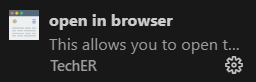

# Horiseon: Challenge1-Marketing-Agency-Refactor

This is a Marketing Agency website. The codebase is written in HTML and CSS. This is a basic landing page with styling to display the information. The website includes a navigation bar, hero image, sections below with content and images displayed, and lastly a footer.

## Installation

To install the code, pull from GitHub repo.
https://github.com/NicoleBrubaker/Challenge1-Marketing-Agency-Refactor

To run the website locally, install the extension 'Open in Browser'. This will allow users to open and view the HTML file locally in the browser of their choice.

## License

MIT (https://choosealicense.com/licenses/mit/)

## Project Status

This website is currently up to date with semantic HTML and updated accessibility.

Link to deployed application: https://nicolebrubaker.github.io/Challenge1-Marketing-Agency-Refactor/

Link to the updated codebase: https://github.com/NicoleBrubaker/Challenge1-Marketing-Agency-Refactor
